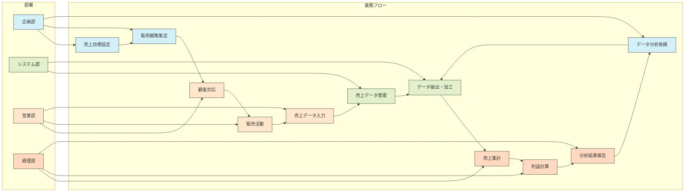

```mermaid
flowchart LR
    %% 部署の配置
    subgraph 部署["部署"]
        direction TB
        企画部["企画部"]
        システム部["システム部"]
        営業部["営業部"]
        経理部["経理部"]
    end
    
    %% 業務プロセス
    subgraph 業務フロー["業務フロー"]
        A1["売上目標設定"]
        A2["販売戦略策定"]
        A3["データ分析依頼"]
        B1["売上データ管理"]
        B2["データ抽出・加工"]
        C1["顧客対応"]
        C2["販売活動"]
        C3["売上データ入力"]
        D1["売上集計"]
        D2["利益計算"]
        D3["分析結果報告"]
    end
    
    %% 部署から業務への接続
    企画部 --> A1
    企画部 --> A2
    企画部 --> A3
    システム部 --> B1
    システム部 --> B2
    営業部 --> C1
    営業部 --> C2
    営業部 --> C3
    経理部 --> D1
    経理部 --> D2
    経理部 --> D3
    
    %% プロセスの流れ
    A1 --> A2
    A2 --> C1
    C1 --> C2
    C2 --> C3
    C3 --> B1
    B1 --> B2
    A3 --> B2
    B2 --> D1
    D1 --> D2
    D2 --> D3
    D3 --> A3
    
    %% スタイル
    classDef default fill:#f9f9f9,stroke:#333,stroke-width:1px
    classDef planning fill:#d4f1f9,stroke:#333,stroke-width:1px
    classDef system fill:#e2f0cb,stroke:#333,stroke-width:1px
    classDef sales fill:#ffe6cc,stroke:#333,stroke-width:1px
    classDef accounting fill:#ffd9c0,stroke:#333,stroke-width:1px
    
    class 企画部,A1,A2,A3 planning
    class システム部,B1,B2 system
    class 営業部,C1,C2,C3 sales
    class 経理部,D1,D2,D3 accounting
```

